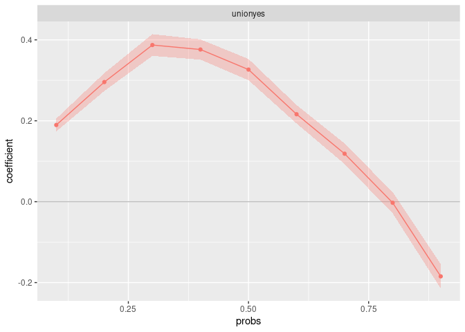

- <a href="#rifreg-estimate-recentered-influence-function-regressions"
  id="toc-rifreg-estimate-recentered-influence-function-regressions"><code>rifreg</code>:
  Estimate recentered influence function regressions</a>
  - <a href="#overview" id="toc-overview">Overview</a>
  - <a href="#installation" id="toc-installation">Installation</a>
  - <a href="#background" id="toc-background">Background</a>
    - <a href="#unconditional-partial-effects"
      id="toc-unconditional-partial-effects">Unconditional partial effects</a>
    - <a href="#estimation" id="toc-estimation">Estimation</a>
    - <a href="#inference" id="toc-inference">Inference</a>
  - <a href="#example" id="toc-example">Example</a>
    - <a href="#unconditional-quantile-regressions"
      id="toc-unconditional-quantile-regressions">Unconditional quantile
      regressions</a>
    - <a href="#bootstrapping-standard-errors"
      id="toc-bootstrapping-standard-errors">Bootstrapping standard errors</a>
    - <a href="#other-distributional-statistics"
      id="toc-other-distributional-statistics">Other distributional
      statistics</a>
    - <a href="#user-written-rif-functions"
      id="toc-user-written-rif-functions">User-written RIF functions</a>
  - <a href="#replication-of-firpo-fortin-and-lemieux-2009a"
    id="toc-replication-of-firpo-fortin-and-lemieux-2009a">Replication of
    Firpo, Fortin, and Lemieux (2009a)</a>
    - <a href="#data-preparation" id="toc-data-preparation">Data
      preparation</a>
    - <a href="#unconditional-quantile-regressions-1"
      id="toc-unconditional-quantile-regressions-1">‘Unconditional quantile
      regressions’</a>
    - <a href="#results" id="toc-results">Results</a>
  - <a href="#credits" id="toc-credits">Credits</a>
  - <a href="#references" id="toc-references">References</a>

<!-- README.md is generated from README.Rmd. Please edit that file -->

# `rifreg`: Estimate recentered influence function regressions

## Overview

Recentered influence function (RIF) regressions estimate the effects of
small location shifts in continuous explanatory variables on a
distributional statistic (e.g., quantile, variance or Gini coefficient)
of an outcome variable as proposed by [Firpo, Fortin, and Lemieux
(2009a)](https://doi.org/10.3982/ECTA6822). In the special case of
quantiles, RIF regressions are ‘unconditional quantile regressions’
capturing the association between explanatory variables and quantiles of
the marginal distribution of an outcome variable.

## Installation

You can either install the CRAN version of `rifreg`

``` r
install.packages("rifreg")
```

or the latest development version from GitHub:

``` r
devtools::install_github("samumei/rifreg")
```

## Background

### Unconditional partial effects

Firpo, Fortin, and Lemieux (2009a) propose RIF regressions to estimate
unconditional partial effects (UPE), i.e., the effects of small
locations shifts in a continuous explanatory variable $X$ on a
distributional statistic $\nu=\nu(F_Y)$ of an outcome variable $Y$.

An influence function, as concept from robust statistics, informs about
the extent a statistic of an empirical marginal distribution changes due
to increasing the probability mass at value $y$ by a small amount. A
recentered influence functions is defined as the influence function
recentered around the original distributional statistic:
$$\text{RIF}(y;\nu,F_Y)= \nu(F_Y)+ \text{IF}(y;\nu,F_Y)$$

The expected value of a recentered influence function equals the
original distributional statistic. Firpo et al. apply the law of
iterated expectations to reformulate the distributional statistic in
terms of the conditional expectations of the explanatory variables:
$$\nu(F_Y) = \int \text{RIF}(y;\nu,F_Y) dF_Y=  \int E(\text{RIF}(Y;\nu,F_Y)|X=x) dF_X(x)$$

This allows them to express the unconditional partial effects as average
derivatives
$$\alpha(\nu) = \int \frac{d E(\text{RIF}(Y;\nu,F_Y)|X=x)}{dx} dF_X(x).$$

### Estimation

Firpo et al. propose to approximate the conditional expectation of the
RIF given the explanatory variables with a linear regression. The
regression coefficients can be consistent estimates of the average
derivatives $\widehat{\alpha}(\nu)$ if the conditional expectations of
the RIF are linear in $X$ (see Firpo et al., 2009, [Rothe 2015:
328](https://doi.org/10.1080/07350015.2014.948959)).

`rifreg` implements this approach. It first calculates the RIF of the
outcome variable $Y$ and a distributional statistic of interest $\nu$.
Then, it runs an OLS regression of the transformed outcome variable $Y$
on the explanatory variables $X$.

By default, the RIF of quantiles, the mean, the variance, the Gini
coefficient, the interquantile range and the quantile ratio are
available in `rifreg`. Moreover, the package allows to calculate the RIF
for additional statistics with user-written functions (see example
below). [Cowell and Flachaire
(2007)](https://doi.org/10.1016/j.jeconom.2007.01.001), [Essama-Nssah &
Lambert (2012)](https://doi.org/10.1108/S1049-2585(2012)0000020009), and
[Rios-Avila (2020)](https://doi.org/10.1177/1536867X20909690) derive the
influence funtions for an array of distributional statistics.

For the sake of illustration, consider the RIF of a quantile
$q_\tau = \inf_q \{q: F_Y(q) \geq \tau\}$. It is defined as
$$\text{RIF}(y;q_\tau,F_Y) = q_\tau  + \frac{\tau-1\{y \leq q_\tau\}}{f_Y(q_\tau)}, $$
where $1\{\}$ is an indicator function and $f_Y(q_\tau)$ is the density
at the quantile of interest. Thus, calculating the RIF requires
estimating the sample quantile and the kernel density. The regression in
the second step essentially amounts to a linear probability model (see
Firpo et al., 2009a: 958, 961).

### Inference

`rifreg` allows to bootstrap standard errors. Analytical standard errors
can be nontrivial when the RIF introduces an additional estimation step.
In particular, this is the case for quantiles where the density has to
be estimated (see [Firpo, Fortin, and Lemieux,
2009b](https://www.econometricsociety.org/publications/econometrica/2009/05/01/unconditional-quantile-regressions/supp/6822_extensions_0.pdf)).

Per default, `summary.rifreg` and `plot.rifreg`return
heteroscedasticity-consistent standard errors estimated with
`sandwich::sandwich()` if the variance is not bootstrapped. Note,
however, that these standard errors do not take the variance introduced
by the RIF estimation step into account.

## Example

In this basic example, we use a sample of the male wage data from the
Current Population Survey from 1983 to 1985 as used in Firpo et
al. (2009a).

``` r
library(rifreg)
#> Loading required package: ggplot2
data("men8385")
```

### Unconditional quantile regressions

We are interested in the unconditional quantile partial effects (UQPE)
of union membership on log hourly wages. We therefore estimate RIF
regressions on union status and control for demographic characteristics.
The parameter `statistic` specifies quantiles as our distributional
statistic of interest, while `probs` defines the probabilities of the
quantiles.

``` r
ffl_model <- log(wage) ~ union + nonwhite + married + education + experience
fit_uqr <- rifreg(ffl_model,
  data = men8385,
  weights = weights,
  statistic = "quantiles",
  probs = 1:9 / 10
)
fit_uqr
#> Rifreg coefficients:
#>                        rif_quantile_0.1 rif_quantile_0.2 rif_quantile_0.3
#> (Intercept)                 0.970857088      1.179109721      1.358386467
#> unionyes                    0.198602743      0.298897702      0.386994339
#> nonwhiteyes                -0.119114400     -0.169377662     -0.213310984
#> marriedyes                  0.201798293      0.235994063      0.252969436
#> educationElementary        -0.330658130     -0.458475630     -0.541317352
#> educationHS dropout        -0.366434292     -0.314803541     -0.278251916
#> educationSome College       0.049659609      0.110356109      0.151998138
#> educationCollege            0.201144576      0.328957233      0.446340964
#> educationPost-graduate      0.141083238      0.278262795      0.411585674
#> experience0-4              -0.567399813     -0.675621784     -0.744535859
#> experience5-9              -0.083794606     -0.159418282     -0.253447553
#> experience10-14            -0.032102547     -0.076472362     -0.116601430
#> experience15-19            -0.021649604     -0.036089249     -0.045319698
#> experience25-29             0.004401242      0.003212986      0.008231836
#> experience30-34            -0.004767943     -0.006481069      0.002965612
#> experience35-39            -0.003914586      0.006038244      0.019524965
#> experience>=40              0.064694355      0.057780569      0.034726270
#>                        rif_quantile_0.4 rif_quantile_0.5 rif_quantile_0.6
#> (Intercept)                 1.576432103       1.74646597       1.90337416
#> unionyes                    0.364913513       0.34030574       0.22422100
#> nonwhiteyes                -0.199584659      -0.19077337      -0.15140862
#> marriedyes                  0.194950211       0.15861935       0.11051797
#> educationElementary        -0.516700583      -0.50630503      -0.37539155
#> educationHS dropout        -0.231527526      -0.20853794      -0.14443228
#> educationSome College       0.173841919       0.19289983       0.15746081
#> educationCollege            0.457356514       0.49512703       0.42651001
#> educationPost-graduate      0.461351523       0.53302843       0.48655626
#> experience0-4              -0.687106540      -0.64823661      -0.47173107
#> experience5-9              -0.307969066      -0.36149797      -0.29791375
#> experience10-14            -0.152827202      -0.18921874      -0.16379394
#> experience15-19            -0.071870567      -0.06551663      -0.04962905
#> experience25-29             0.002968522       0.01863508       0.03043321
#> experience30-34             0.012083234       0.03899880       0.04962817
#> experience35-39             0.022326253       0.03524896       0.04742285
#> experience>=40              0.001684911       0.01020244       0.00867607
#>                        rif_quantile_0.7 rif_quantile_0.8 rif_quantile_0.9
#> (Intercept)                  2.08335156      2.243138267       2.50910141
#> unionyes                     0.13231888      0.008239871      -0.15515221
#> nonwhiteyes                 -0.12267681     -0.112884094      -0.11827633
#> marriedyes                   0.07976414      0.057116207       0.05285737
#> educationElementary         -0.32376628     -0.256429944      -0.26626430
#> educationHS dropout         -0.12677063     -0.102227401      -0.08536648
#> educationSome College        0.15809893      0.148460496       0.16684309
#> educationCollege             0.44437130      0.454287435       0.60641514
#> educationPost-graduate       0.54341643      0.616454232       0.89050987
#> experience0-4               -0.43860774     -0.391417522      -0.45705327
#> experience5-9               -0.31332993     -0.299200841      -0.36542130
#> experience10-14             -0.19495274     -0.190724443      -0.24722551
#> experience15-19             -0.07479452     -0.085321103      -0.11087371
#> experience25-29              0.02868761      0.045826795       0.08953774
#> experience30-34              0.04377733      0.078268103       0.07987727
#> experience35-39              0.02694454      0.028296285       0.06769310
#> experience>=40              -0.01456717     -0.015007184      -0.02721068
```

The `summary` method returns the estimated coefficients and the standard
errors. Per default, `summary` returns heteroscedasticity-consistent
standard errors estimated if the variance is not bootstrapped.

``` r
summary(fit_uqr)
```

`rifreg` comes with a convenient plot function. It illustrates the
estimated UQPE across the distribution. The confidence bands are based
on the same standard errors as returned by `summary`.

``` r
plot(fit_uqr, varselect = "unionyes")
#> Warning in plot.rifreg(fit_uqr, varselect = "unionyes"): Standard errors have not been bootstrapped!
#> Analytical s.e. do not take variance introduced by
#> estimating the RIF into account.
```


### Bootstrapping standard errors

Setting `bootstrap=TRUE` bootstraps standard errors by resampling from
all observations and reestimating both the RIF and the regression in
every iteration. We can set number of `bootstrap_iterations` and the
number of `cores`.

``` r
fit_uqr <- rifreg(ffl_model,
  data = men8385,
  weights = weights,
  statistic = "quantiles",
  bootstrap = TRUE,
  bootstrap_iterations = 100, 
  cores = 4,
  probs = 1:9 / 10
)
#> Bootstrapping Standard Errors...

plot(fit_uqr,
  varselect = "unionyes",
  confidence_interval = 0.95
)
```



### Other distributional statistics

`rifreg` performs RIF regressions for other distributional statistics
than quantiles. Per default, the “mean”, “variance”, “quantiles”,
“gini”, “interquantile_range” and “interquantile_ratio” are available.

``` r
ffl_model2 <- wage ~ union + nonwhite + married + education + experience
fit_gini <- rifreg(ffl_model2,
  data = men8385,
  weights = weights,
  statistic = "gini"
)
fit_d9d1 <- rifreg(ffl_model2,
  data = men8385,
  weights = weights,
  statistic = "interquantile_ratio",
  probs = c(0.9, 0.1)
)
cbind(fit_gini$estimates, fit_d9d1$estimates)
#>                           rif_gini rif_iq_ratio_0.9_0.1
#> (Intercept)            -3.60225797            4.8851827
#> unionyes               -0.98769909           -3.1983486
#> nonwhiteyes             0.83273753            0.9804660
#> marriedyes             -0.70975056           -2.3156881
#> educationElementary     2.12101685            2.9971699
#> educationHS dropout     0.97020642            4.2520301
#> educationSome College  -0.85371897            0.1127903
#> educationCollege       -2.49171458            0.1489916
#> educationPost-graduate -2.92713536            2.1686951
#> experience0-4           2.94517028            5.1423852
#> experience5-9           1.63033635           -0.5625992
#> experience10-14         0.93208423           -0.6913670
#> experience15-19         0.37262020           -0.2184045
#> experience25-29        -0.17086373            0.3417035
#> experience30-34        -0.24904725            0.4147115
#> experience35-39        -0.17830041            0.3498597
#> experience>=40         -0.01665794           -0.9383281
```

### User-written RIF functions

Users may write their own RIF function. Custom RIF functions must
specify a `dep_var` parameter for the outcome variable $Y$, a `weights`
for potential sample weights, and `probs`. If they are not needed, they
must be set to `NULL` in the function definition (e.g. `probs = NULL`).

The following example shows how to write the RIF for the top 10 percent
income share and, then, to estimate the RIF regression using this custom
function. The formula for this specific RIF can be found in Essam-Nssah
& Lambert (2012) or Rios-Avila (2020).

``` r
ffl_model2 <- wage ~ union + nonwhite + married + education + experience

# custom RIF function for top 10% percent income share
custom_top_inc_share <- function(dep_var,
                                 weights,
                                 probs = NULL,
                                 top_share = 0.1) {
  top_share <- 1 - top_share
  weighted_mean <- weighted.mean(
    x = dep_var,
    w = weights
  )
  weighted_quantile <- Hmisc::wtd.quantile(
    x = dep_var,
    weights = weights,
    probs = top_share
  )
  lorenz_ordinate <- sum(dep_var[which(dep_var <= weighted_quantile)] *
    weights[which(dep_var <= weighted_quantile)]) /
    sum(dep_var * weights)
  if_lorenz_ordinate <- -(dep_var / weighted_mean) * lorenz_ordinate +
    ifelse(dep_var < weighted_quantile,
      dep_var - (1 - top_share) * weighted_quantile,
      top_share * weighted_quantile
    ) / weighted_mean
  rif_top_income_share <- (1 - lorenz_ordinate) - if_lorenz_ordinate
  rif <- data.frame(rif_top_income_share, weights)
  names(rif) <- c("rif_top_income_share", "weights")
  return(rif)
}

fit_top_10 <- rifreg(ffl_model2,
  data = men8385,
  weights = weights,
  statistic = "custom",
  custom_rif_function = custom_top_inc_share,
  top_share = 0.1
)

fit_top_10
#> Rifreg coefficients:
#>                        rif_top_income_share
#> (Intercept)                     0.256731886
#> unionyes                       -0.068997798
#> nonwhiteyes                     0.007531907
#> marriedyes                     -0.017344324
#> educationElementary             0.024329590
#> educationHS dropout             0.022054504
#> educationSome College           0.002197374
#> educationCollege                0.031589544
#> educationPost-graduate          0.080400757
#> experience0-4                   0.014372720
#> experience5-9                  -0.018702959
#> experience10-14                -0.026032457
#> experience15-19                -0.013896898
#> experience25-29                 0.007969714
#> experience30-34                 0.008465597
#> experience35-39                 0.005562271
#> experience>=40                  0.002429636
```

## Replication of Firpo, Fortin, and Lemieux (2009a)

To validate the functions and provide users with an additional example,
we replicate the RIF regression estimates in Firpo et al. (2009a:
962-966). In their empirical example, Firpo et al. estimate the impact
of union status on log wages using a large sample of 266’956 male U.S.
workers from 1983-1985 based on the Outgoing Rotation Group (ORG)
supplement of the Current Population Survey. To reproduce the code
below, make sure you download the [entire data set from the journal’s
website](https://www.econometricsociety.org/publications/econometrica/2009/05/01/unconditional-quantile-regressions/supp/6822_data%20and%20programs_0.zip).

### Data preparation

``` r
library("dplyr")
#> 
#> Attaching package: 'dplyr'
#> The following objects are masked from 'package:stats':
#> 
#>     filter, lag
#> The following objects are masked from 'package:base':
#> 
#>     intersect, setdiff, setequal, union

## getting the data from the journal's website
# url <- "https://www.econometricsociety.org/publications/econometrica/2009/05/01/unconditional-quantile-regressions/supp/6822_data%20and%20programs_0.zip"
# download.file(url = url, destfile = "6822_data%20and%20programs_0.zip")
# men8385 <- readstata13::read.dta13(file = unzip("6822_data%20and%20programs_0.zip","men8385.dta"))

## Load data
men8385 <- readstata13::read.dta13("men8385.dta")

# Save dummies as factor variables
# nine potential experience categories (each of five years gap)
men8385$experience <- 5
men8385[which(men8385$ex1 == 1), "experience"] <- 1
men8385[which(men8385$ex2 == 1), "experience"] <- 2
men8385[which(men8385$ex3 == 1), "experience"] <- 3
men8385[which(men8385$ex4 == 1), "experience"] <- 4
# 5 = reference group
men8385[which(men8385$ex6 == 1), "experience"] <- 6
men8385[which(men8385$ex7 == 1), "experience"] <- 7
men8385[which(men8385$ex8 == 1), "experience"] <- 8
men8385[which(men8385$ex9 == 1), "experience"] <- 9

# Education
men8385$education <- 2
men8385[which(men8385$ed0 == 1), "education"] <- 0
men8385[which(men8385$ed1 == 1), "education"] <- 1
# high school = reference group
men8385[which(men8385$ed3 == 1), "education"] <- 3
men8385[which(men8385$ed4 == 1), "education"] <- 4
men8385[which(men8385$ed5 == 1), "education"] <- 5

men8385$education <- as.character(men8385$education)
men8385$experience <- as.character(men8385$experience)
men8385$experience <- dplyr::recode_factor(men8385$experience,
  "5" = "20-24",
  "1" = "0-4",
  "2" = "5-9",
  "3" = "10-14",
  "4" = "15-19",
  "6" = "25-29",
  "7" = "30-34",
  "8" = "35-39",
  "9" = ">=40"
)

men8385$education <- dplyr::recode_factor(men8385$education,
  "2" = "High School",
  "0" = "Elementary",
  "1" = "HS dropout",
  "3" = "Some College",
  "4" = "College",
  "5" = "Post-graduate"
)

# Save log wage as wage hourly wage in dollars
men8385$wage <- exp(men8385$lwage)

# Rename/relevel remaining indicators
men8385$union <- as.factor(men8385$covered)
men8385$covered <- NULL

men8385$married <- as.factor(men8385$marr)
men8385$marr <- NULL
men8385$nonwhite <- as.factor(men8385$nonwhite)
levels(men8385$married) <- levels(men8385$nonwhite) <- levels(men8385$union) <- c("no", "yes")

# Rename weight and education in years variable
names(men8385)[names(men8385) == "eweight"] <- "weights"
names(men8385)[names(men8385) == "educ"] <- "education_in_years"
names(men8385)[names(men8385) == "exper"] <- "experience_in_years"

# Check experience and age groups
men8385 %>%
  group_by(experience) %>%
  dplyr::summarise(
    min = min(experience_in_years, na.rm = TRUE),
    max = max(experience_in_years, na.rm = TRUE)
  )
#> # A tibble: 9 × 3
#>   experience   min   max
#>   <fct>      <dbl> <dbl>
#> 1 20-24         20    24
#> 2 0-4            0     4
#> 3 5-9            5     9
#> 4 10-14         10    14
#> 5 15-19         15    19
#> 6 25-29         25    29
#> 7 30-34         30    34
#> 8 35-39         35    39
#> 9 >=40          40    58

men8385 %>%
  group_by(education) %>%
  dplyr::summarise(
    min = min(education_in_years, na.rm = TRUE),
    max = max(education_in_years, na.rm = TRUE)
  )
#> # A tibble: 6 × 3
#>   education       min   max
#>   <fct>         <dbl> <dbl>
#> 1 High School      12    12
#> 2 Elementary        0     8
#> 3 HS dropout        9    11
#> 4 Some College     13    15
#> 5 College          16    16
#> 6 Post-graduate    17    18

# Select relevant variables
sel_vars <- c("wage", "union", "nonwhite", "married", "education", "experience", "weights", "age", "education_in_years", "experience_in_years")
men8385 <- men8385[, sel_vars]
```

### ‘Unconditional quantile regressions’

The model is specified as in Firpo, Fortin, and Lemieux (2007a),
omitting weights, computing bootstrapped standard errors with 200
iterations and setting a fixed bandwidth of 0.06 for the kernel density
estimation. We also compute a OLS model for comparison with the original
results.

``` r
library(rifreg)

set.seed(121095)
ffl_model_2009 <- log(wage) ~ union + nonwhite + married + education + experience
ffl_uqr_fit <- rifreg(
  formula = ffl_model_2009,
  data = men8385,
  statistic = "quantiles",
  probs = seq(0.05, 0.95, 0.05),
  bw = 0.06,
  bootstrap = TRUE,
  bootstrap_iterations = 200, 
  cores = 1
)
#> Bootstrapping Standard Errors...

ffl_ols_fit <- lm(
  formula = ffl_model_2009,
  data = men8385
)
```

### Results

``` r
estimates <- data.frame(ffl_uqr_fit$estimates[1:9, c("rif_quantile_0.1", "rif_quantile_0.5", "rif_quantile_0.9")])
standard_errors <- data.frame(ffl_uqr_fit$bootstrap_se[1:9, c("rif_quantile_0.1", "rif_quantile_0.5", "rif_quantile_0.9")])
results <- cbind(estimates, standard_errors)[, c(1, 4, 2, 5, 3, 6)]
results$ols <- ffl_ols_fit$coefficients[1:9]
names(results) <- c("Coefficient 0.1", "SE", "Coefficient 0.5", "SE", "Coefficient 0.9", "SE", "OLS")

knitr::kable(results)
```

|                        | Coefficient 0.1 |        SE | Coefficient 0.5 |        SE | Coefficient 0.9 |        SE |        OLS |
|:-----------------------|----------------:|----------:|----------------:|----------:|----------------:|----------:|-----------:|
| (Intercept)            |       0.9704165 | 0.0050124 |       1.7346767 | 0.0056697 |       2.5112831 | 0.0085605 |  1.7418195 |
| unionyes               |       0.1950164 | 0.0026616 |       0.3361029 | 0.0037823 |      -0.1345583 | 0.0043157 |  0.1790582 |
| nonwhiteyes            |      -0.1161961 | 0.0050775 |      -0.1635135 | 0.0043629 |      -0.0989621 | 0.0044194 | -0.1339497 |
| marriedyes             |       0.1943921 | 0.0038844 |       0.1556403 | 0.0033141 |       0.0430328 | 0.0038816 |  0.1395608 |
| educationElementary    |      -0.3063238 | 0.0075381 |      -0.4510738 | 0.0060972 |      -0.2396602 | 0.0045286 | -0.3512943 |
| educationHS dropout    |      -0.3438799 | 0.0062425 |      -0.1942754 | 0.0040358 |      -0.0679424 | 0.0034208 | -0.1897010 |
| educationSome College  |       0.0579543 | 0.0040457 |       0.1782772 | 0.0040114 |       0.1533879 | 0.0050320 |  0.1333362 |
| educationCollege       |       0.1962486 | 0.0040961 |       0.4635776 | 0.0050486 |       0.5810668 | 0.0082048 |  0.4064842 |
| educationPost-graduate |       0.1379375 | 0.0037447 |       0.5212637 | 0.0058163 |       0.8430019 | 0.0117381 |  0.4777400 |

Our results largely match those by Firpo, Fortin, and Lemieux (2009a:
964, Table I). The OLS results are identical as expected. The RIF
regression results differ only in a few instances at the third decimal
place from the original paper.

``` r
rifreg_plot <- plot(ffl_uqr_fit, varselect = "unionyes")
```

``` r
rifreg_plot +
  geom_hline(yintercept = ffl_ols_fit$coefficients["unionyes"], linetype = "dashed") +
  geom_text(aes(x = 0.8, y = ffl_ols_fit$coefficients["unionyes"] + 0.03, label = "OLS estimate"), color = "black") +
  ylab("Effect of Union") +
  xlab("Quantiles") +
  labs(title = "Unconditional Quantile Regression in R") +
  theme(strip.background = element_blank(), strip.text.x = element_blank())
```


Looking at the plots, we see that our plots correspond to those
presented by Firpo, Fortin, and Lemieux (2009a: 965). The plot example
illustrates, how the plot from the generic `rifreg::plot()` function can
be further enhanced, for instance with a horizontal line indicating the
OLS coefficient for comparison.

This validation example illustrates that the `rifreg` package works as
intended in computing RIF regressions and reliably yields the expected
results.

## Credits

David Gallusser & Samuel Meier

## References

Cowell, Frank A., and Emmanuel Flachaire. 2007. “Income distribution and
inequality measurement: The problem of extreme values.” *Journal of
Econometrics* 141: 1044–1072.

Essama-Nssah, Boniface, and Peter J. Lambert. 2012. “Influence Functions
for Policy Impact Analysis.” In John A. Bishop and Rafael Salas, eds.,
*Inequality, Mobility and Segregation: Essays in Honor of Jacques
Silber*. Bigley, UK: Emerald Group Publishing Limited.

Firpo, Sergio, Nicole M. Fortin, and Thomas Lemieux. 2007a.
“Unconditional Quantile Regressions.” *Tech- nical Working Paper 339,
National Bureau of Economic Research*. Cambridge, MA.

Firpo, Sergio, Nicole M. Fortin, and Thomas Lemieux. 2009a.
“Unconditional Quantile Regressions.” *Econometrica* 77(3): 953-973.

Firpo, Sergio, Nicole M. Fortin, and Thomas Lemieux. 2009b. “Supplement
to ‘Unconditional Quantile Regressions’.” *Econometrica Supplemental
Material*, 77.

Rios-Avila, Fernando (2020): “Recentered influence functions (RIFs) in
Stata: RIF regression and RIF decomposition.” *The Stata Journal* 20(1):
51-94.

Rothe, Christoph (2015): “Decomposing the Composition Effect. The Role
of Covariates in Determining Between-Group Differences in Economic
Outcomes.” *Journal of Business & Economic Statistics* 33(3): 323-337.
